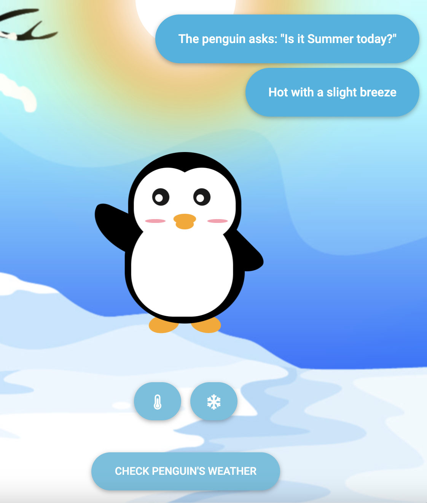

# Penguin's Weather Report

This is a React component called `PenguinWeather` that displays a penguin and allows users to check the weather. The penguin's behavior changes based on the season and light condition selected by the user.

## Installation

To use the `PenguinWeather` component in your React application, you need to follow these steps:

1. Install the required dependencies by running the following command:

   ```
   npm install react react-dom bootstrap react-icons
   ```

2. Import the necessary modules in your desired file:

   ```javascript
   import React from 'react';
   import ReactDOM from 'react-dom';
   import "bootstrap/dist/css/bootstrap.css";
   import PenguinWeather from './PenguinWeather';
   import './index.css';

   // Render the PenguinWeather component
   ReactDOM.render(<PenguinWeather />, document.getElementById('root'));
   ```

3. Create an `index.css` file in the same directory as your component file, and add the required styles.

4. Customize the component and its styles as per your requirements.

## Usage

To use the `PenguinWeather` component in your application, simply import it and place it wherever you want to display it. Here's an example:

```javascript
import React from 'react';
import PenguinWeather from './PenguinWeather';

function App() {
  return (
    <div>
      <h1>Welcome to Penguin's Weather Report</h1>
      <PenguinWeather />
    </div>
  );
}

export default App;
```

## Component Structure

The `PenguinWeather` component consists of the following elements:

- `SpeechBubble`: A functional component that renders a speech bubble for displaying the penguin's weather-related messages.

- `PenguinWeather` class component: The main component that manages the state and behavior of the penguin and handles user interactions.


## Features

- The atmosphere changes based on the selected season (summer or winter) and light condition (sunny or cloudy).
- The penguin's eyes follow the mouse movement.
- Users can click on buttons to toggle the season (sunny or cloudy) and see the penguin's response.
- The penguin displays different weather messages based on the selected season and light condition.
- The weather messages are randomly selected from predefined options.
- A loading state is displayed while fetching the weather information.
- The component includes a footer with attribution to the author.

## Live Demo

Try the live demo of the Tic-Tac-Toe app: [Demo](http://anyaparanya.com/penguin-weather)


## Screenshots



Feel free to customise the component and add additional features as needed.